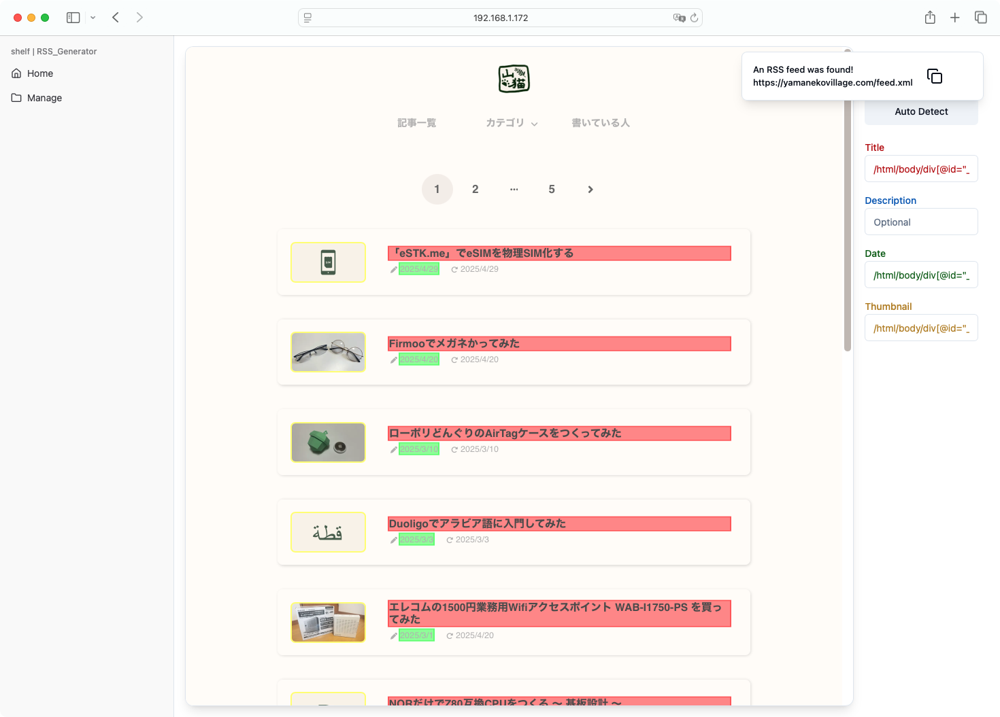
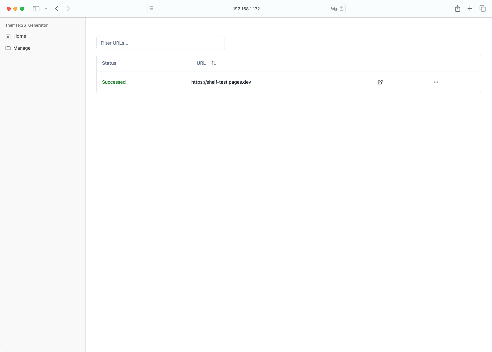

# shelf | RSS_Generator

### A lightweight RSS feed generator with an intuitive UI

## Quickstart

```shell
git clone https://github.com/projects-shelf/RSS_Generator.git
cd RSS_Generator
docker-compose up -d
```

## Features

### RSS Feed Generation

Generate RSS feeds from websites that do not natively provide them.


### Easy-to-use

A user-friendly interface that makes the process straightforward and accessible.





### AI-Powered

Utilizes the Gemini API to automatically extract the required XPath for generating RSS feeds.

### Lightweight

Built with Go and SQLite, it consumes minimal system resources.

```
CONTAINER ID   NAME                 CPU %     MEM USAGE / LIMIT    MEM %     NET I/O           BLOCK I/O         PIDS
e3b23edaef2c   shelf_rssgen_nginx   0.00%     2.23MiB / 3.88GiB    0.06%     8.41MB / 8.44MB   15.4MB / 475kB    2
b89a68bf41b6   shelf_rssgen_go      0.04%     10.49MiB / 3.88GiB   0.26%     2.16MB / 6.7MB    41.8MB / 0B       11
c0044a5a6190   politepol            1.55%     148.4MiB / 3.88GiB   3.74%     98.5MB / 64.7MB   8.79GB / 26.4MB   16
f7e416a540c8   dbpolitepol          0.13%     174.6MiB / 3.88GiB   4.39%     15.8MB / 28.6MB   7.22GB / 303kB    29
```

## License

RSS_Generatot is licensed under [MIT License](https://github.com/projects-shelf/RSS_Generator/blob/main/LICENSE).

## Author

Developed by [PepperCat](https://github.com/PepperCat-YamanekoVillage).
